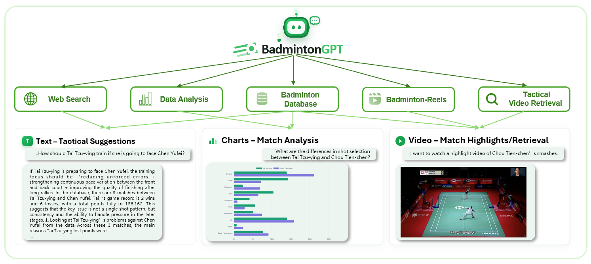
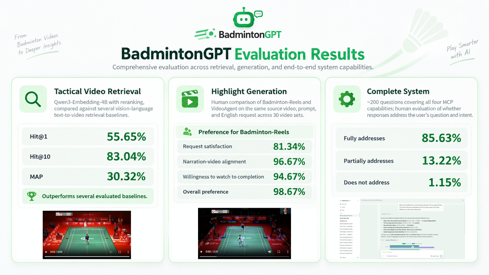

# BadmintonGPT

<p align="center">
  
</p>

<p align="center"><strong>From badminton videos to deeper match insights.</strong></p>

<p align="center">
  Ask tactical questions · Compare players · Explore match data · Find clips · Create highlights
</p>

<p align="center">
  <a href="https://badmintongpt.nycu-adsl.cc/">Live WebUI</a> ·
  <a href="#what-can-badmintongpt-do">Features</a> ·
  <a href="#quick-start">Quick start</a> ·
  <a href="#architecture">Architecture</a> ·
  <a href="#evaluation">Evaluation</a> ·
  <a href="#documentation">Docs</a>
</p>

BadmintonGPT is a badminton match assistant built on [nanobot](https://github.com/HKUDS/nanobot). Ask in the WebUI, and it chooses the match database, analysis tools, web search, video retrieval, or highlight generation to answer with text, charts, and video.

## Start here

| You want to... | Go to |
| --- | --- |
| Open BadmintonGPT online | [badmintongpt.nycu-adsl.cc](https://badmintongpt.nycu-adsl.cc/) |
| See what the assistant can answer | [Features and example questions](#what-can-badmintongpt-do) |
| Run the complete system | [Quick start](#quick-start) and the [deployment guide](docs/DEPLOY.md) |
| Understand the components | [Architecture](#architecture) and [design notes](docs/DESIGN.md) |
| Review the reported results | [Evaluation](#evaluation) |
| Add another badminton tool | [MCP integration guide](docs/ADD_NEW_MCP.md) |

## What can BadmintonGPT do?

| Ask for... | BadmintonGPT can return... |
| --- | --- |
| **Match facts and player comparisons** | Answers grounded in the badminton match database |
| **Tactical and statistical analysis** | Shot, rally, and match comparisons with charts |
| **A specific play or rally** | Relevant clips found through natural-language video retrieval |
| **A highlight reel** | A generated video assembled by the remote reels service |
| **Recent or external information** | A response supported by web search |

Try questions such as:

> How should Tai Tzu-ying prepare to face Chen Yufei?
>
> What are the shot-selection differences between Tai Tzu-ying and Chou Tien-chen?
>
> Find a clip of Chou Tien-chen's smashes, or make a highlight video of a match.

The interface can combine these capabilities in one response—for example, a tactical explanation alongside a comparison chart or playable video.

## Architecture



The browser talks to a nanobot agent. The agent uses skill instructions to choose among a local read-only match database, remote badminton services, and web search. Results appear in the WebUI as answers, charts, or embedded videos.

| Component | Role |
| --- | --- |
| **Badminton database** | Local SQLite match, rally, and shot data built from the [Badminton dataset](https://huggingface.co/datasets/howard9199/Badminton) and exposed through an MCP service |
| **Data analysis** | Calculates comparisons and creates visual explanations from match data |
| **Badminton-Reels** | Generates highlight videos through a remote MCP service |
| **Tactical video retrieval** | Finds relevant clips from a natural-language request |
| **Web search** | Adds public information outside the match database |

The database MCP runs in its own container. The video and analysis MCP services are remote integrations; the [design notes](docs/DESIGN.md) explain the routing and data flow in detail.

## Quick start

### 1. Prepare the services

You need Docker with Compose, an OpenAI API key, a Hugging Face token with access to the Badminton dataset, credentials for the remote badminton services, and a Cloudflare Tunnel. The [deployment guide](docs/DEPLOY.md) walks through the one-time Tunnel and Access setup.

```bash
cp .env.example .env
```

Fill in `OPENAI_API_KEY`, `HF_TOKEN`, `REELS_CF_CLIENT_ID`, `REELS_CF_CLIENT_SECRET`, `VIDEO_RETRIEVAL_CF_CLIENT_ID`, `VIDEO_RETRIEVAL_CF_CLIENT_SECRET`, `ANALYZE_MCP_TOKEN`, and `TUNNEL_TOKEN` in `.env`. Set `BADMINTONGPT_HOSTNAME` to your public hostname.

### 2. Build the database and start the app

```bash
docker compose --profile ingest run --rm ingest
docker compose up -d --build
```

The first command creates `data/badminton.db`; the second starts the WebUI gateway, database MCP, and Cloudflare Tunnel. Open `https://<your-badmintongpt-hostname>/` after the services are healthy.

### 3. Check the system

```bash
docker compose ps
docker compose exec gateway curl -fsS http://127.0.0.1:18790/health
docker compose exec badminton-db curl -fsS http://127.0.0.1:8801/healthz
```

For end-to-end checks and troubleshooting, use the [deployment guide](docs/DEPLOY.md). The database build and remote services need their own credentials and data access; filling only the OpenAI key is not enough.

## Evaluation



The reported evaluation looks at three parts of the experience: finding tactical clips, judging generated highlights, and checking whether answers address the user's question. The figure summarizes the results, including **55.65% Hit@1** for tactical video retrieval, **98.67% overall preference** for Badminton-Reels in the highlight comparison, and **85.63% fully addressed** responses in the complete-system review.

## Documentation

| Guide | What it covers |
| --- | --- |
| [Deployment](docs/DEPLOY.md) | Cloudflare setup, database build, verification, and operations |
| [System design](docs/DESIGN.md) | Agent routing, MCP connections, and data flow |
| [Requirements and example questions](docs/TASK.md) | Project goals and acceptance questions |
| [Adding an MCP](docs/ADD_NEW_MCP.md) | How to connect another local or remote service |
| [Monitoring](docs/MONITORING.md) | Health checks and the status page |
