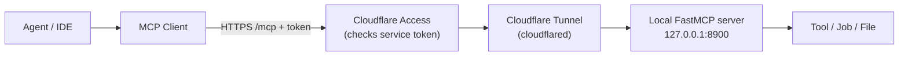

# Remote MCP Server Guide

Build an MCP server, run it locally, and deploy it as a **remote service** any MCP client (agents, IDEs)
can call over the network. A complete, runnable reference implementation ships alongside this guide:
**`example-mcp-server/`**.

## Who this is for

You're comfortable with **Python** and know the **basics of MCP** (an LLM/agent calls "tools" your
server exposes), and you want to put an MCP server **online** so an agent can reach it.

**Prerequisites**
- Python **3.10+** and [`uv`](https://docs.astral.sh/uv/) (or plain `pip`).
- For the *remote* part only: a **Cloudflare account** with a **domain** on it.

**What you'll have at the end:** a working MCP server reachable at `https://<your-host>/mcp`, protected by
an auth token, that an agent can connect to and call.

> Reading path: **Concepts → Architecture → Run locally → Deploy remotely → Connect a client →
> Troubleshooting**. If you just want it running, skip to *Run it locally*.

---

## Concepts (1 minute)

**MCP (Model Context Protocol)** is a standard way for an LLM/agent to discover and call your code. Your
server exposes **tools** (functions the agent can call), and optionally **resources** (readable data) and
**prompts** (templates). Full spec: <https://modelcontextprotocol.io>.

An MCP server can run two ways:

| | **Local (stdio)** | **Remote (HTTP)** ← this guide |
|---|---|---|
| How the client reaches it | spawns your process locally | over the network at a URL |
| Good for | quick local tools | heavy/long jobs, GPU, shared across teams, wrapping a service |
| Transport | stdio | **Streamable HTTP** (endpoint at `/mcp`) |

This guide uses the official **`mcp` Python SDK** (`FastMCP`) with **Streamable HTTP**.

---

## Architecture (mental model)



What each hop does:

1. **Agent / IDE** wants to call a tool.
2. **MCP Client** opens a Streamable-HTTP session to `https://<your-host>/mcp`, sending the auth headers.
3. **Cloudflare Access** checks the service token at the edge; no token → blocked (401/403).
4. **Cloudflare Tunnel** (`cloudflared`) forwards allowed traffic to your machine — no open ports, no
   public IP, TLS handled for you.
5. **FastMCP server** (bound to `127.0.0.1`) handles the MCP request.
6. It runs a **tool**, kicks off a **job**, or serves a **file**.

Locally (the next section) you talk straight to step 5 — no Cloudflare needed.

---

## Run it locally

Get **`example-mcp-server/`** (it ships with this guide; on the docs site use the *Download* button).

```bash
cd example-mcp-server
python --version            # need 3.10+
uv sync                     # create venv + install deps   (or: pip install mcp)
python server.py            # start the server
```

You should see uvicorn start:

```
INFO:     Started server process [12345]
INFO:     Uvicorn running on http://127.0.0.1:8900 (Press CTRL+C to quit)
```

In a **second shell**, verify it:

```bash
curl -s http://127.0.0.1:8900/healthz
# -> {"ok": true}

python smoke_test.py http://127.0.0.1:8900/mcp
```

Expected success output:

```
tools: ['add', 'echo', 'start_render', 'get_render_status', 'get_render_result']
add(2,3) -> {'sum': 5.0}
start_render -> {'job_id': '2669ffa4...', 'state': 'queued'}
status -> running 1/3 [1/3] preparing assets
status -> running 2/3 [2/3] rendering frames
status -> running 3/3 [3/3] encoding output
status -> succeeded 3/3 done
result -> {'ready': True, 'url': 'http://127.0.0.1:8900/files/2669ffa4...'}
OK ✅
```

No `.env` is needed for local runs. When that works, you have a real MCP server — now make it remote.

---

## Server reference

### Defining tools

A tool is a decorated function. Its **docstring** is what the agent reads to decide when to call it, so
make it precise. Return JSON-serializable data; on failure return `{"error": "..."}` instead of raising.
Validate inputs.

```python
from mcp.server.fastmcp import FastMCP

mcp = FastMCP("example-mcp", host="127.0.0.1", port=8900)

@mcp.tool()
def add(a: float, b: float) -> dict:
    """Add two numbers and return {"sum": a+b}."""
    return {"sum": a + b}

def main():
    mcp.run(transport="streamable-http")   # endpoint at /mcp
```

Tool names: `^[A-Za-z0-9_-]+$`, unique, non-empty description, valid JSON-Schema `inputSchema` (FastMCP
derives it from type hints).

### HTTP endpoints

| Method & Path | Purpose | Auth |
|---|---|---|
| `POST /mcp` | MCP Streamable HTTP (initialize, tools/list, tools/call, …) | required |
| `GET /healthz` | Liveness probe → `{"ok": true}` | required* |
| `GET /files/{id}` | Download an artifact produced by a job | required* |

\* Behind Cloudflare Access, **every** path on the host requires the service token.

Add non-MCP routes with `@mcp.custom_route`:

```python
from starlette.requests import Request
from starlette.responses import JSONResponse, FileResponse

@mcp.custom_route("/healthz", methods=["GET"])
async def healthz(request: Request):
    return JSONResponse({"ok": True})
```

### Async job contract (long tasks)

Never block a tool for minutes. Split long work into three tools:

| Tool | Input | Output |
|---|---|---|
| `start_<x>` | job spec | `{job_id, state}` |
| `get_<x>_status` | `job_id` | `{job_id, state, stage, total_stages, message, error?}` |
| `get_<x>_result` | `job_id` | `{ready, url, …}` |

`state ∈ {queued, running, succeeded, failed}` — **exactly** these four; clients treat
`succeeded` / `failed` as terminal. The client calls `start_*`, polls `get_*_status` (typically every
10–60 s) until terminal, then calls `get_*_result`. See `start_render` / `get_render_status` /
`get_render_result` in `example-mcp-server/server.py` (a background thread does the work; the demo job
store is in-memory — use a DB/redis/file in production so it survives restarts).

#### Progress reporting (required for long jobs)

Status responses drive the caller's UI — consuming agents render a **live progress bar** automatically
from these fields, so report them on every poll:

| Field | Type | Meaning |
|---|---|---|
| `stage` | int | current step, `0..total_stages` |
| `total_stages` | int | total number of steps |
| `message` | str | one-line human-readable current step, e.g. `"[2/3] rendering frames"` |
| `job_id` | str | echo it in every payload so clients can correlate polls |

Rules:

- `get_<x>_status` must return **immediately** — clients poll it; never block inside it.
- **Derive `total_stages` from the real pipeline** (e.g. `len(STEPS)`, or thread the total through your
  progress callback). A hardcoded total silently desyncs when you add a step — the caller's progress
  bar then shows `6/5`.
- On success, set `stage = total_stages` so the bar completes at 100%.
- `get_<x>_result` returns `ready: true` **only** after `state == "succeeded"`.

### File delivery

Return a **downloadable URL**, never a local path (remote clients can't read your disk):

```python
import os
PUBLIC_BASE_URL = os.getenv("PUBLIC_BASE_URL", "https://example-mcp.<your-zone>")

@mcp.custom_route("/files/{job_id}", methods=["GET"])
async def serve_file(request: Request):
    job_id = request.path_params["job_id"]
    ...  # 404 if not ready
    return FileResponse(path, filename=f"{job_id}.bin")

# get_render_result returns: {"ready": True, "url": f"{PUBLIC_BASE_URL}/files/{job_id}"}
```

---

## Deploy remotely

### 1. Configure & run the server

Bind to `127.0.0.1` (only the tunnel reaches it). Set env (e.g. in `.env`):

| Var | Default | Purpose |
|---|---|---|
| `MCP_HOST` | `127.0.0.1` | bind address |
| `MCP_PORT` | `8900` | port |
| `PUBLIC_BASE_URL` | — | public origin, used to build file URLs |

### 2. Expose with Cloudflare Tunnel

No open ports, no public IP, no self-managed TLS.

```bash
cloudflared tunnel login
cloudflared tunnel create example-mcp
# edit ~/.cloudflared/config.yml   (template: deploy/cloudflared.config.example.yml)
cloudflared tunnel route dns example-mcp example-mcp.<your-zone>
cloudflared tunnel run example-mcp
```

```yaml
# ~/.cloudflared/config.yml
tunnel: <TUNNEL_ID>
credentials-file: /home/<user>/.cloudflared/<TUNNEL_ID>.json
ingress:
  - hostname: example-mcp.<your-zone>
    service: http://127.0.0.1:8900     # /mcp, /healthz, /files all go here
  - service: http_status:404
```

> **Use a first-level subdomain** (`example-mcp.<your-zone>`), not a deeper one
> (`example-mcp.api.<your-zone>`). Free Cloudflare Universal SSL only covers the apex and `*.<your-zone>`;
> a 2-level subdomain has no cert and its custom domain hangs at "Verifying".

### 3. Protect with Cloudflare Access (service token)

A public endpoint must be gated, or anyone can call your tools.

1. Zero Trust → **Access → Applications → Add → Self-hosted**; domain = `example-mcp.<your-zone>`.
2. **Access → Service Auth → Create Service Token** → copy **Client ID** and **Client Secret**.
3. Add a policy: **Action = Service Auth**, Include = that token.

Only requests with `CF-Access-Client-Id` / `CF-Access-Client-Secret` reach your origin. Give each server
its own token, named per server (e.g. `EXAMPLE_CF_CLIENT_ID` / `EXAMPLE_CF_CLIENT_SECRET`).

### 4. Keep it running (systemd)

Run the server **and** the tunnel as user services so they survive crashes/reboots (templates:
`deploy/example-mcp.service`, `deploy/cloudflared-example-mcp.service`):

```bash
systemctl --user daemon-reload
systemctl --user enable --now example-mcp cloudflared-example-mcp
loginctl enable-linger "$USER"      # survive logout / reboot
```

---

## Connect a client / agent

Point any MCP client at `https://example-mcp.<your-zone>/mcp` with the service-token headers:

```python
import asyncio, os
from mcp import ClientSession
from mcp.client.streamable_http import streamablehttp_client

HEADERS = {
    "CF-Access-Client-Id": os.environ["EXAMPLE_CF_CLIENT_ID"],
    "CF-Access-Client-Secret": os.environ["EXAMPLE_CF_CLIENT_SECRET"],
}

async def main():
    async with streamablehttp_client("https://example-mcp.<your-zone>/mcp", headers=HEADERS) as (r, w, _):
        async with ClientSession(r, w) as s:
            await s.initialize()
            print([t.name for t in (await s.list_tools()).tools])   # ['add', 'echo', 'start_render', ...]
            print(await s.call_tool("add", {"a": 2, "b": 3}))       # -> {'sum': 5.0}

asyncio.run(main())
```

Agent frameworks register it the same way: a streamable-HTTP MCP server at the `/mcp` URL with those two
headers.

### Hand-off: the registration JSON

When your server is deployed, the deliverable to the consuming agent team is **one JSON block** —
most agent frameworks (nanobot, Claude Desktop, …) register MCP servers in exactly this shape —
plus the service-token values sent over a secure channel:

```json
{
  "mcpServers": {
    "example-mcp": {
      "type": "streamableHttp",
      "url": "https://example-mcp.<your-zone>/mcp",
      "headers": {
        "CF-Access-Client-Id": "${EXAMPLE_CF_CLIENT_ID}",
        "CF-Access-Client-Secret": "${EXAMPLE_CF_CLIENT_SECRET}"
      },
      "enabledTools": ["add", "echo", "start_render", "get_render_status", "get_render_result"]
    }
  }
}
```

- Keep `${VAR}` placeholders in the JSON — the consumer stores the real token values in their own
  `.env` and the framework substitutes them at startup. Never put the secret itself in the JSON.
- **Name the env vars after your server** (`EXAMPLE_CF_*`) so a consumer can hold tokens for several
  MCP servers side by side without collisions.
- `enabledTools` is the consumer-side whitelist — list exactly the tools you intend them to call.
- Alongside the JSON, hand over: the tool list with one-line descriptions, the async-job contract
  fields if you have long tasks (see *Server reference*), and the Client ID/Secret (the secret is
  shown only once at creation — transmit it securely).

---

## Troubleshooting

| Symptom | Likely cause | Fix |
|---|---|---|
| `ModuleNotFoundError: No module named 'mcp'` | wrong/old Python (e.g. system 3.8) | use Python **3.10+**; `uv sync` then `.venv/bin/python server.py` |
| client hangs / `ConnectError` to localhost | server not running on that port | confirm `python server.py` is up; `curl 127.0.0.1:<port>/healthz` |
| `curl: (35) … handshake failure` / `code 000` on the public URL | no TLS cert yet, or nothing serving | check the tunnel + origin (below); for a new custom domain wait for the cert to issue |
| public URL returns **530** | tunnel has no active connection (origin unreachable) | `cloudflared tunnel info <name>`; restart `cloudflared tunnel run <name>`; verify `curl 127.0.0.1:<port>/healthz` locally |
| **401 / 403** | missing/wrong Access token headers | send both `CF-Access-Client-Id` and `CF-Access-Client-Secret`; check the Service Auth policy on the Access app |
| custom domain stuck at **"Verifying"** | 2-level subdomain not covered by free Universal SSL | use a **first-level** subdomain (or enable Advanced Certificate Manager / Total TLS) |
| (CI) `wrangler … Project not found [code: 8000007]` | the Pages/target project doesn't exist | create it first (e.g. `wrangler pages project create <name> --production-branch=main`) |

**Healthy smoke test** prints the `tools: [...]`, `add(2,3) -> {'sum': 5.0}`, the `start_render →
status → result` lines, and `OK ✅` (see *Run it locally*). If you get that locally but not remotely, the
problem is in the tunnel/Access layer, not your server.

---

## Checklist

- [ ] Server binds `127.0.0.1`; not exposed directly (tunnel only).
- [ ] Cloudflare Access service token set; all paths (incl. `/files`) protected.
- [ ] First-level subdomain (free SSL coverage).
- [ ] Secrets in env / `.env`, never committed.
- [ ] Inputs validated; tools return JSON, `{"error": ...}` on failure.
- [ ] Long tasks use the async job contract and report `stage`/`total_stages`/`message` in status; tools never block.
- [ ] Hand-off JSON delivered (`mcpServers` entry with `${VAR}` placeholders + per-server env-var names); token secret sent securely, never committed.
- [ ] Artifacts returned as URLs, not local paths.
- [ ] `GET /healthz` present.
- [ ] Server + tunnel run under systemd (`Restart=always`, linger enabled).
