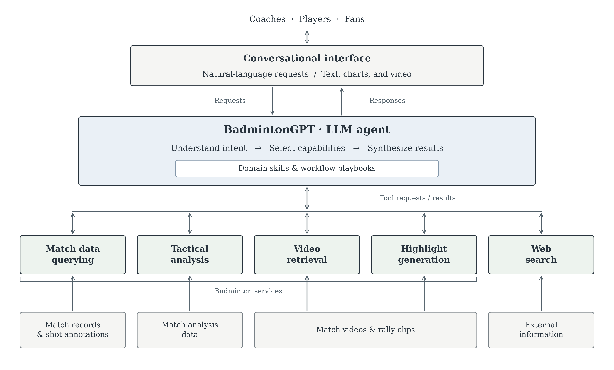

# BadmintonGPT architecture

**Suggested paper caption.** High-level architecture of BadmintonGPT. A conversational interface connects users to an LLM agent guided by domain skills and workflow playbooks. The agent selects match-data querying, tactical analysis, video retrieval, highlight generation, or web search, and synthesizes returned evidence and media into text, charts, and video. Bidirectional arrows represent requests and responses; upward arrows from data sources represent the information supporting each capability. The shared video block is a conceptual resource category, not a claim that both services use the same physical storage.

## Architectural interpretation

BadmintonGPT is a conversational orchestration system. Its central agent interprets requests, selects specialized tools, and assembles results for the user. Domain skills provide procedures for using those tools, including statistics, visualization, and waiting for long-running video jobs. This separates task guidance from capability access.

The configured system exposes four badminton services: a local match database, remote tactical analysis, remote video retrieval, and remote highlight generation. These use MCP (Model Context Protocol); web search is a separate built-in capability. General statistics are computed from retrieved records, while specialized movement and spatial metrics come from the tactical-analysis service. The figure folds these calculation and presentation procedures into the agent to keep the architecture high level.

The flow can involve several tool calls. For example, the agent can identify a match using the database, request its tactical analysis, and present the resulting findings. Video retrieval finds existing clips; highlight generation creates a new edit. Both return their results through the same conversational interface.

## Scope and evidence

This figure describes the repository's configured integrations, as inspected on 2026-09-09. It is based on source and configuration inspection, not a live service availability test. It intentionally omits deployment, model versions, database schemas, tool names, transport details, and polling mechanics.

- [README](../../README.md): current capability overview and integration topology.
- [Agent configuration](../../nanobot/config.json): configured service connections and web interface.
- [Agent routing](../../nanobot/workspace/SOUL.md): task selection, database-to-analysis lookup, output presentation, and job handling.
- [Database implementation](../../mcps/badminton-db/server.py): read-only access to match records.
- [Analysis playbook](../../skills/badminton-analyze/SKILL.md), [retrieval playbook](../../skills/badminton-video-retrieval/SKILL.md), and [highlight playbook](../../skills/badminton-reels/SKILL.md): specialized capabilities.
- [Data-analysis playbook](../../skills/data-analysis/SKILL.md): calculation from retrieved data followed by presentation.

The earlier [research-methods report](../串接所有計畫成果的羽球助理BadmintonGPT_研究方法.md) also discusses simulation, 3D visualization, and smart-venue data. They are broader project concepts; dedicated integrations for these capabilities are not present in the inspected configuration and are therefore omitted from this implementation-oriented figure. Earlier documents also contain historical counts and integration lists; the figure avoids those changing details.

## Files

- `badmintongpt_architecture.pdf`: vector figure for paper submission.
- `badmintongpt_architecture.svg`: editable vector figure with text labels.
- `badmintongpt_architecture.png`: 300 dpi preview (3600 × 2175 pixels).
- `draw_architecture.py`: reproducible Matplotlib source; run with `python3 report/figures/draw_architecture.py` from the repository root.
