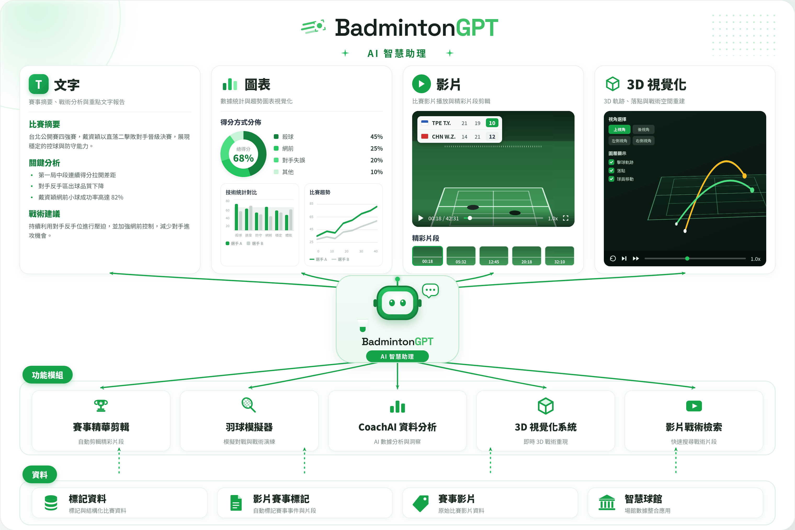

# 串接所有計畫成果的羽球助理 BadmintonGPT

### **二、 研究方法**

本子計畫的核心目標，是把整合型計畫中各子計畫的成果——逐拍標記資料、賽事影片精華、戰術模擬、資料分析、3D 視覺化與影片檢索——**串接成單一的對話式入口**，讓教練、選手與一般愛好者只要用自然語言，就能把一整場羽球比賽變成「**可問、可看、可分析**」的資料。為達成此目標，我們設計了一條涵蓋「**資料層 → 功能模組層 → 呈現層**」的三層端到端架構，並由一個大型語言模型（LLM）代理人（agent）居中**編排（orchestrate）**各子計畫的能力。其中，本子計畫的三項核心創新分別為：**（一）以模型脈絡協定（MCP）為存取層、以 skill playbook 為行為層的混合式代理架構**、**（二）由單一代理人統一編排五大功能模組、跨子計畫成果即查即用**，以及 **（三）文字、圖表、影片與 3D 四模態的統一呈現，搭配非同步長任務的同輪輪詢機制**。以下先說明動機與定位（2.1），再自底層而上逐層拆解三層架構（2.2–2.5），最後說明實際支撐系統運作的關鍵技術（2.6–2.7）。

#### **2.1 介紹：動機、特色與目標受眾**

通用大型語言模型（如 ChatGPT）已能流暢回答羽球規則、選手背景等一般性問題；但一旦問題落到「某一場具體比賽的內部事實」，便立刻碰壁。本子計畫的設計起點，正是要補上這道落差。

**動機：補上通用 LLM 的三道缺口。** 通用模型對具體賽事有三項根本性的無能為力——其一，**找不到「那一拍」**：缺乏逐拍標註資料，無法回答「這場 Axelsen 用殺球得了幾分」「最常見的失分原因是什麼」這類需要查詢結構化賽事資料的問題，只能憑印象含糊作答甚至編造；其二，**生不出精華影片**：不掌握比賽影片與逐拍時間碼，無法把「幫我做一支精華短影音」落地成一個可播放的檔案；其三，**沒辦法模擬比賽**：缺乏羽球專用模擬器，無法推演「若改變發球策略，這一回合會如何演變」。BadmintonGPT 以一個會用工具、能查證、能產出影音的羽球專用代理人，精準補上這三道缺口。

**特色：把整場比賽變成「可問、可看、可分析」的資料。** 一場比賽的價值，過去被鎖在「影片檔＋人工標記表＋分析師腦中」三處彼此割裂的形式裡。本系統把它轉化為三種可互動的形態：**可問**——任何逐拍事實都能用自然語言問出，系統在背後轉成單句唯讀 SQL 查詢資料庫，先說結論、附上關鍵數字與依據；**可看**——使用者可要求生成含計分板與旁白的精華短片，並直接在對話中內嵌 `<video>` 播放器播放，亦能以 3D 球場軌跡重現關鍵回合；**可分析**——系統取得原始資料後，以沙箱化 Python 計算統計（勝率、占比、分布、排名），再渲染成互動圖表。三種形態共用同一入口、同一份賽事資料。

**目標受眾：教練、選手與羽球愛好者。** 三類使用者透過同一個自然語言介面、由工具路由各取所需：**教練**著重戰術洞察與資料分析（對手球種偏好、失分模式、關鍵分情境）；**選手**著重自我複盤與關鍵時刻回顧（找出那一拍、回看特定戰術回合、以 3D 軌跡檢視走位）；**羽球愛好者**著重觀賽體驗與分享（一鍵生成可發布的精華、賽事報導式摘要）。

圖?、通用 LLM 的三道缺口（找不到那一拍／生不出精華／無法模擬）與 BadmintonGPT 對應補位示意圖。

目前以「資料查詢、精華生成、戰術模擬」三類缺口作為設計起點；未來可隨各子計畫成果持續擴充，把更多羽球專用能力（如即時對局建議、個人化訓練處方）納入同一代理入口。

#### **2.2 系統架構：資料、功能模組、呈現三層**

把多個異質子計畫成果整合進單一助理，最大的風險是淪為彼此不通的「功能拼盤」。為此，本系統採清楚的三層分工：底層沉澱各子計畫產出的資料與素材，中層把素材轉成可呼叫的功能模組，頂層則面向使用者做多模態呈現；一個 LLM 代理人貫穿三層，**由上而下發出使用者意圖、由下而上回傳結果**，是整個系統的中樞。

圖?、BadmintonGPT 三層架構圖（資料層 → 功能模組層 → 呈現層）。

以下 2.3–2.5 自底層而上，逐一說明三層的組成，並在功能模組層標註各模組對應的來源子計畫。

#### **2.3 資料層：各子計畫沉澱的賽事素材**

任何分析與生成都需要可信的事實基礎。資料層彙整各子計畫產出的結構化標記、影片與場館資料，是整個系統的事實底座。

**標記資料與影片賽事標記（子計畫四）。** 來自 CoachAI 資料庫的逐拍標記，每一拍涵蓋球種（type）、發球與接發、繞頭與反拍、擊球區域（hit_area）、落點區域（landing_area）、得失分原因（win_reason／lose_reason）與當下比分（roundscore）等十餘個欄位，是「可問」與「可分析」的事實依據。**賽事影片（子計畫四）** 則是與標記對齊的比賽影片與預切回合片段（rally clips），為精華剪輯與影片檢索提供素材。**智慧球館（子計畫五）** 提供場館端擷取比賽資料的來源，銜接賽事資料的產生端。

**資料模型。** 資料以三張表組織——`matches`（比賽目錄）、`rallies`（回合）、`shots`（逐拍）；`rallies`／`shots` 一律以 **`match_name`**（即 `matches.name`、不含 `.mp4`）為 join key 對應 `matches`。本雛形資料庫收錄 **27 場正式賽事、約 24,000 筆逐拍紀錄**（以 ShuttleSet 衍生資料建置）；對接子計畫四的完整平台後，可擴及 305 場、22.7 萬筆以上。

目前以離線建置的 SQLite 快照供查詢；未來可由智慧球館（子計畫五）串流即時比賽資料並自動入庫，使助理能服務「進行中的比賽」。

#### **2.4 功能模組層：代理人居中編排的五大能力**

資料本身不會說話，需要功能模組把它轉成能力。本層是各子計畫成果的主要交會點——代理人依使用者意圖，把同一份賽事資料導向最合適的模組。五大模組與其來源子計畫對應如下：

* **賽事精華剪輯（子計畫二與子計畫一）**：子計畫二的 Multi-Agent 賽事影片精華生成，搭配子計畫一的敘事結構多模態精華生成（即本報告參考之姊妹子計畫），把比賽剪成含旁白與計分板的短片。
* **羽球模擬器（子計畫一）**：以 RallyDiffuser／CoachLLM 進行戰術模擬，支援「若改變策略、回合如何演變」的推演。
* **CoachAI 資料分析（子計畫四）**：資料分析儀表板與圖表（得分方式分析、雷達圖、趨勢圖）。
* **3D 視覺化系統（子計畫三）**：3D 球場軌跡與球員姿態視覺化。
* **影片翻譯檢索（子計畫二／子計畫三）**：以語意化的文字→影片檢索，用自然語言找到對應片段。

關鍵在於：BadmintonGPT 代理人**不自行實作**這些能力，而是把每個模組封裝成可呼叫的工具，居中決策「何時呼叫哪一個」（存取機制見 2.6、決策路由見 2.7）。

目前各模組由代理人單點呼叫；未來可支援跨模組的工作流編排，讓一次提問觸發多個子計畫成果協同產出（例如「檢索 → 分析 → 精華」串成一條 pipeline）。

#### **2.5 呈現層：四種輸出模態**

羽球分析的成果形態多元，單靠純文字無法完整傳達。呈現層把功能模組的產出，依內容性質渲染成最合適的模態，並全部內嵌在同一個對話介面：**文字**（賽事報導、賽事分析、關鍵時刻、戰術建議；先說結論、附關鍵數字與依據）、**圖表**（得分方式分析、雷達圖、趨勢圖；以可互動圖表而非靜態圖片呈現）、**影片**（含計分板的精華短片；以內嵌 `<video>` 播放器直接播放）、**3D 視覺化**（重現關鍵回合擊球與走位的 3D 球場軌跡）。

目前四模態各自獨立呈現；未來可在同一則回覆中並陳多模態（文字結論＋圖表佐證＋精華片段＋3D 軌跡），形成完整的「賽事報告卡」。

#### **2.6 系統技術（一）：代理框架與 MCP 存取層**

要讓 LLM 真正「會用工具做事」而非只描述會怎麼做，需要一個能掛載工具、管理對話與工具迴圈、並提供 Web 介面的代理框架。整體技術採 2026 年的混合式代理架構——**模型脈絡協定（MCP）為存取層、skill playbook 為行為層**——由 LLM 代理人居中編排。

**代理框架：nanobot。** 系統以 `nanobot gateway` 啟動，內含代理迴圈與 WebSocket WebUI；本系統使用 HKUDS/nanobot v0.2.1 的自有 fork（隨倉庫一併建置）。代理人的人格、工具路由規則與資料庫查詢慣例集中寫在 `SOUL.md`，作為事實上的系統提示（de-facto system prompt）。**LLM 模型** 由環境變數驅動（預設 `gpt-5.5`、provider 為 openai），另提供可切換的「Custom」OpenAI 相容模型預設；溫度（temperature）設為 0.1，以求查詢與路由的穩定。

**MCP（存取層）：決定代理人「能存取什麼」。** 每個外部能力封裝成一台 MCP 伺服器，代理人只透過標準化工具呼叫。系統接上三台：**`badminton-db`**（本地 FastMCP，封裝 **SQLite** 資料庫）僅暴露 `list_tables`、`describe_table`、`query` 三個工具，其中 `query` 以唯讀模式（`mode=ro`）開庫、**只接受單句 SELECT**（含分號的多句或任何非 SELECT 一律拒絕，最多回傳 200 列），是代理人讀取資料庫的唯一途徑，以 streamable-HTTP 服務於 `/mcp`、埠 8801；**`badminton-reels`**（遠端 MCP，子計畫二的成果）非同步生成精華影片，工具為 `generate_reel`、`get_reel_status`、`get_reel_result`；**`util`**（本地 stdio MCP）僅一個 `sleep`（秒數 ≤ 60）工具，用於為輪詢迴圈計時。此外另含內建 **web search**（查資料庫沒有的外部最新資訊）與 **exec Python 沙箱**（bwrap、僅標準庫）負責統計計算。MCP 的權限收斂（唯讀、單句 SELECT、限定工具集）是系統安全的第一道防線。

圖?、MCP 存取層 + skill 行為層的混合式代理架構圖。

目前以三台 MCP 對應三類能力；未來新的子計畫成果可以同一套 MCP 介面掛載進來（如把 3D 視覺化、模擬器各自包成 MCP），讓存取層隨計畫線性擴充、無需改動代理人核心。

#### **2.7 系統技術（二）：skill 行為層、工具路由與非同步長任務**

知道「能存取什麼」還不夠，代理人更需要知道「該怎麼用、何時用」。若把所有領域知識塞進系統提示會臃腫難維護，因此本系統以 **skill playbook 作為行為層**，採漸進式揭露（progressive disclosure）按需載入。

**五個 skill。** `badminton-db`（資料庫 enum 取值、A／B↔姓名對照、查詢慣例，如查特定比賽務必用 `match_name` 篩、回合片段須 `WHERE has_video=1`）、`badminton-reels`（精華生成參數與領域慣例）、`long-mcp-job`（通用「非同步長任務」的輪詢配方）、`visualise`（把圖表渲染成 WebUI 可內嵌的 `visualizer` code fence）、`data-analysis`（統計流程：先用 MCP 取數、再用 exec Python 計算、最後畫圖）。一句話概括本系統的核心設計模式：**MCP 決定「能存取什麼」、skill 決定「應如何行為」，這組存取／行為分離是整個系統的骨幹。**

**工具路由（寫在 SOUL.md）。** 代理人依問題型別選擇模組：資料庫問題 → `badminton-db` skill 並呼叫 `query`；「做一支精華」 → `badminton-reels` skill 並呼叫 reels MCP；任何非同步 job → `long-mcp-job` 配方；資料庫沒有的外部資訊 → web search；「視覺化／圖表」 → `visualise` skill 輸出 `visualizer` fence；任何統計／分析 → 先以 exec Python 計算、再交給 `visualise`。

**非同步長任務：同輪輪詢機制。** 精華渲染需數分鐘，系統設計一套「同輪安靜輪詢」把等待與進度回饋都收在一輪對話內完成：取得 `job_id` 後**立刻先查一次** `get_reel_status`（讓進度條馬上出現），之後「util `sleep`（10–60 秒，依進度自行拿捏）→ 再查」輪詢到 terminal（最多約 10 分鐘），`succeeded` 後以 `get_reel_result` 取回結果。其間有三條鐵則：①**一次回應只呼叫一個工具**（status 與 sleep 絕不並列，否則進度條會延遲約 30 秒）；②**輪詢期間不輸出文字**（純文字回應會結束本輪、中斷輪詢，進度由 WebUI 自動顯示）；③**絕不使用 cron**（nanobot 的 cron 是提醒中繼而非任務執行器，只會把訊息當提醒唸出，不會真的輪詢）。

目前以固定上限與人工拿捏的間隔輪詢、路由規則為人工撰寫的啟發式；未來可改以事件推送（webhook／server-push）取代輪詢並支援多任務並行，並蒐集真實對話軌跡訓練更精準的意圖分類器來輔助路由。
